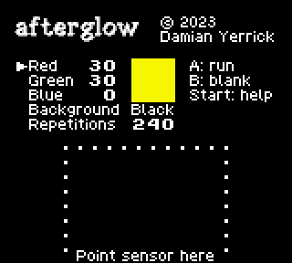

afterglow
=========

This program for the Game Boy compact video game system is used
with a photometer to measure the fast and slow decay of images on a
display, such as phosphors in a CRT TV.  Decay means how long the
TV keeps giving off light after the input goes dark.  Use it on
Super Game Boy, Game Boy Player, or even the handheld if your
photometer can focus on a small enough area.

Different colors decay differently.  You can set the red, green,
and blue levels of the color to test.  Decay toward white may
differ from decay toward black.  You can choose either.  The border
on Super Game Boy or Game Boy Player may leak light into the test
area.  Use the accessory's menus to set a black border.

Press the B Button to blank the screen while zeroing your photometer.
Press the Start Button to read a summary of these instructions.
Once you press the A Button to begin the test, the screen goes blank
and then repeats the following sequence:

1. Flash white if the background is black (or vice versa)
   for 5 frames (83 ms) to synchronize the photometer recording
2. Show the background for 1 second
3. Flash the chosen color for 5 frames
4. Show the background for 4 seconds

Building from source code requires Coreutils, Python 3, and RGBDS.

Copyright 2023 Damian Yerrick  
This program is free software.  Permission is granted to use it
for any purpose, subject to the zlib License.

Concept by zeta0134
