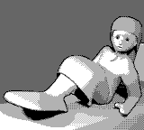

gbpng
=====
Embed a PNG image into a Game Boy ROM

This tool takes a ROM compatible with Game Boy that meets certain
criteria and combines it with a PNG image to make a "polyglot" file,
which is simultaneously a valid ROM and a valid PNG image.  The ROM
can be displayed on a web page or sent through image hosts, and so
long as the server doesn't reencode the image before serving it to
the viewer, the user can run it in a Game Boy emulator.

Building the demo
-----------------
Install RGBDS, Python, and GNU Make.  Then at a terminal, type
`make all` to build or `make run` to build and run.  For the latter,
`GBEMU=sameboy make run` overrides the default emulator.

Coreutils is needed for the `make clean` target. If you have WSL,
MSYS2, Cygwin, or a GNU/Linux distribution installed, you probably
have Make and Coreutils.

Though the example ROM displays the same pixels as the PNG embedded
into it, this need not be the case.  This Game Boy program does not
decode the PNG file.  The image is stored in two different
compression formats: PNG and one the GB can decode time-efficiently.
An easy change is to make them different pictures.  The `pngfile`
variable in the makefile controls which PNG gets appended.  The one
displayed when running the program is `tilesets/Sukey.png`; it must
have dimensions of 160x144 pixels, use a 4-color palette from dark
to light (such as black, dark gray, light gray, white), and have no
more than 256 distinct 8x8-pixel characters.

Adding to your own program
--------------------------
The ROM must have enough blank space at the start and end:

- The first 40 bytes (`rst $00` through `rst $20`) must be unused.
  These hold the PNG's 33-byte header and the header of the chunk
  that contains the Game Boy program.  It's unlikely to work with
  most proprietary games from the commercial era (1989 through 2001).
- If `rst $28` is used, the instruction at $0028 must be a no-op
  because the tool replaces it with `ld l, l` (opcode $6D), which
  is the ASCII code for the last letter of chunk type `prGm`.
- There must be enough unused space at the end of the ROM (detected
  as identical bytes) to hold the entire PNG image minus 25 bytes.
  If you have [OptiPNG], consider `optipng -strip all image.png`
  to remove unnecessary chunks from the image.

Once those are taken care of:

    tools/pngify.py gbfile pngfile outfile

`pngify.py` uses a bit of brute force to ensure that both the ROM's
global byte sum (at $014E in the header) and the `prGm` chunk's CRC32
value are consistent.  This way, neither Game Boy emulators nor
pickier PNG parsers will emit a diagnostic.

[OptiPNG]: https://optipng.sourceforge.net/

Future possibilities
--------------------
I'm interested in seeing proofs of concept to add support for other
consoles' ROM image formats.  Here are some exercises for the reader:

**Game Boy:** The chunk type need not end in `m`.  It can be `v`,
which encodes `halt`, or another lowercase letter from `a` to `z`,
which encode other `ld` instructions.  Find practical uses for
other such instructions as the first instruction of `rst $28`.

**Super NES:** The program has to avoid enough of the last few banks
as well as the first 41 bytes.  Fortunately, these bytes have no
special meaning on a Super NES, and it should be practical to reserve
the space using the linker configuration.  Then correct the LoROM or
HiROM checksum instead of a GB checksum.

**Genesis:** The first 41 bytes overlap the reset vector (at $0005)
and the handlers for the first few exceptions: bus error, address
error, illegal instruction, divide by zero, bounds check, trap on
overflow, privilege violation, and trace.  If your program doesn't
use these, you may be able to build a linker script for an entry
point at address $0A1A0A (or $021A0A for 2 to 4 Mbit ROMs).

**Master System and Game Gear:** Appears tricky.  The CPU starts at
$0000 executing the PNG header, treating the width, height, and CRC32
of the `IHDR` chunk as opcodes.  This limits the combinations of
width, height, and color that an attached image may have, as these
may cause CRC32 values containing unsafe opcodes.  Trying to work
around this by extending `IHDR`, as suggested by Maxim in the SMS
Power community, fails because [libpng rejects oversize] `IHDR`
chunks.

**NES:** Not possible; PNG header overlaps iNES header.

**GBA:** Not possible; PNG header overlaps initial jump and
compressed logo.

[libpng rejects oversize]: https://github.com/glennrp/libpng/blob/a37d4836519517bdce6cb9d956092321eca3e73b/pngpread.c#L227

Legal
-----
Copyright 2018, 2024 Damian Yerrick.

This program is free software distributed under the zlib License.
