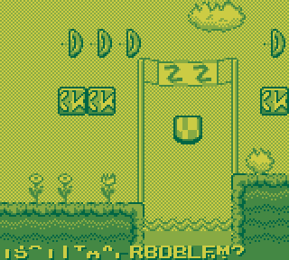

Tearing demo
============

This tech demo for Game Boy draws a background and animates 32
8x8-pixel tiles in video memory by copying 4 bytes per horizontal
blank from ROM to VRAM, or 32 bytes per 8-pixel-tall row of tiles.
It deliberately copies in a manner calculated to induce visible
tearing, placing up to two animated tiles on the tilemap row
corresponding to when they are copied.  It is intended as a
conversation piece about methods to avoid tearing in real games.

Copyright 2021 Damian Yerrick  
License: zlib
