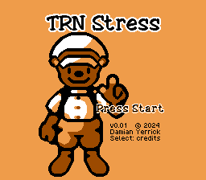
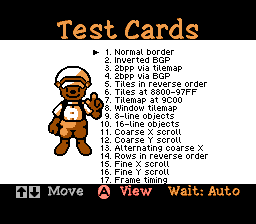
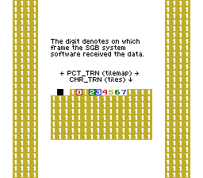
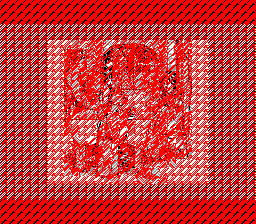

TRN Stress
==========

Testing playground for scrambling VRAM transfer data in a way that
an authentic Super Game Boy accessory can decode and some emulators
that take shortcuts cannot.

Build dependencies: RGBDS, Python 3, Pillow, Bash, Coreutils

Background: Super Game Boy
--------------------------

Game Boy games send game graphics to the display through the GB's
picture processing unit (PPU).  This PPU produces 160 by 144 pixels
at about 60 frames per second.  The SGB contains a bridge chip (ICD2)
that converts these pixels to 5760 bytes of tile data, which the SGB
system software forwards to Super NES video memory.  It also receives
request packets from the GB program to do things like recolor
parts of the screen, play sound effects, or read both controllers.

Two packet types are used to send borders, or colorful pictures
that the SGB draws around and in front of the play area:

- Character transfer (`CHR_TRN`) sends a block of 128 characters, or
  8×8-pixel tiles.  A border can use up to two blocks or 256 tiles.
- Picture transfer (`PCT_TRN`) sends up to three 15-color palettes
  and a 32×28-tile map of what tile, palette, and flipping to use at
  what places on the screen.

Unlike most packets, which contain data inside the packet, transfers
work by treating the first 4096 bytes of a following frame's tile
data as the payload.

Most of the SGB is open-loop, meaning the GB program cannot
observe whether the results took effect on screen.  This makes
emulator acceptance tests a bit more tedious to create and run.

Scrambling
----------

TRN Stress contains 15 different scrambling methods.  These apply
various transformations to the border data in GB video memory (VRAM)
before sending it to the SGB.  These involve changing the tile data
and tilemap, the background palette register (`BGP`), objects (also
called sprites), the window (commonly used for status bars), and the
scroll position.

Each method changes VRAM in a specific way and does something else
to reverse the effect.  This causes the GB PPU to send the same
pixels as if no scrambling had happened.  An emulator that runs the
PPU normally during a transfer will not be affected. An emulator that
takes shortcuts, such as snooping VRAM, can display a corrupt border.

See [spec](docs/spec.md) for details.

Frame timing
------------

This test sends `CHR_TRN` and `PCT_TRN` packets and counts how many
frames it took the SGB to receive their payload.

There was a hypothesis that the SGB reads the transfer data over the
course of several frames, such as 1024 bytes from each of the next
four frames.  This turned out not to be the case.  There's a delay
before the transfer that varies from 1 to 3 frames depending on how
busy the SGB is with other things.

For a test of relative timing between `CHR_TRN` and `PCT_TRN`, see
[The Three Bears](https://github.com/pinobatch/little-things-gb/tree/master/sgbears/).

Results
-------

bgb 1.6.2, SameBoy 0.16.3, Mesen 2 2024-05-13, and BizHawk 2.9.1
Gambatte correctly display all 16 borders and a plausible frame
timing result (often `1[1]1`, sometimes `2[1]2`).

KiGB 2.05 and mGBA 0.11-779-b7729c9 correctly display everything but
BGP tests.  In particular, they display a colored noise pattern for
2bpp via BGP as shown below.
See related [issue in mGBA](https://github.com/mgba-emu/mgba/issues/3220).

  
Figure: Typical failure mode of 2bpp via BGP

VisualBoyAdvance 1.7, VisualBoyAdvance-M 2.1.8, and no$gmb have
trouble with anything involving BGP, window, objects, or scrolling.
In addition, VBA 1.7 and no$gmb hide the portion of the border that
overlaps the play area.  In frame timing, all three show 0 frames of
delay, meaning they read the screen on the same frame during which
the program sends the request.

Goomba Color 12-14-14 shows "This emulator is junior league!" on
the title screen.  This error happens when the CPU does not make
a relative jump (`jr` instruction) from low ROM to HRAM.

Status
------

Scramblers are finished.  The build process produces a version with
all art that uses an MBC and a 32 KiB version with limited art.
Now we seek the rest of the art for the slide show.

- Rearrange menu to hold more than 17 items
- Gather 11 more images: up to 256 by 224 pixels, up to 254 unique
  8x8-pixel tiles, up to 3 subpalettes of 15 colors with each tile
  using colors from one subpalette.  Preferably include
  anthropomorphic bears in mid to late 19th century attire.
- Program the automatic slide show
- Option for only 40 iterations in the DMA wait loop
- Test palette color 0 as backdrop for border
- Test use of tiles 1018-1023 packed into PCT_TRN rows 29-31: a scene
  drawn with semigraphics
- Test palette animation: a bear sitting and thinking with a throbber
  in a thought bubble above his head drawn in colors 9, 10, 11,
  13, 14, and 15, animated with PAL23 packets

Legal
-----

© 2024 Damian Yerrick

This is free software with no warranty.  Permission is granted to
distribute the software subject to the zlib License.

See also [Image credits](docs/image_credits.txt)
